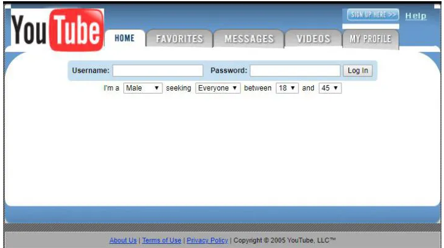
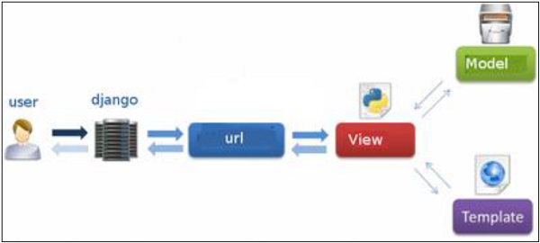
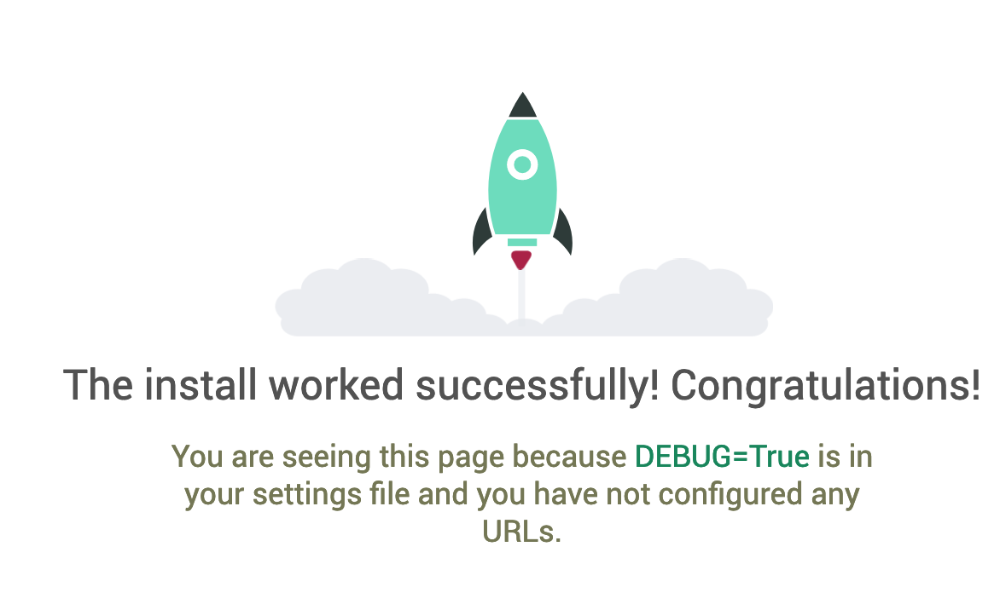

Django is a Python-based web framework, which primary goal is to easy the creation of complex, **relational database-driven** websites.

## History

Django was created in a newspaper in 2003 and released to the public in 2005.

At that time, Internet (2.0) was full of PHP sites, SEO started to be a thing.




So, Django is a framework with 15+ years of existence, that has evolved at the same time as the web. 

### Main Releases:

|  Version |  Year  |    Major new features                                            |
|----------|--------|------------------------------------------------------------------|
| 0.90     | 2005   | First release                                                    |      
| 1.0      | 2008   | API Stability, admin                                             |
| 1.1      | 2009   | Aggregates, transactions based tests                             |
| 1.2      | 2010   | Multiple DB connections, CSRF                                    |
| 1.3      | 2011   | Class Based Views                                                |
| 1.4 LTS  | 2012   | First release                                                    |
| 1.5      | 2013   | Python 3 Support. Configurable user model                        |
| 1.6      | 2013   | DB Transaction, Connection pooling                               |
| 1.7      | 2014   | Migrations in core                                               |
| 1.8 LTS  | 2015   | Support for jinja template engine. contrib.postgres              |
| 1.9      | 2015   | Password validation. New admin style.                            |
| 1.10     | 2016   | Full text search Postgres. New middleware.                       |
| 1.11 LTS | 2017   | Latest to support python 2.7 (Abril 2020)                        |
| 2.0      | 2017   | Python3 only. Simpler URL router. Mobile admin                   |
| 2.1      | 2018   | CheckConstraint on models. More inspectdb and migrations options |
| 2.2 LTS  | 2019   | More Postgres Indexes                                            |  


### Releases support

Mainstream support is eight months per release.

LTS are supported a total of three years since go public.

Since 2.0, there is a change in version format.

* 2.0 - 8 months    
* 2.1 - 8 months
* 2.2 LTS - 8 months + 28 months of extended support.
* 3.0 - 8 months
* 3.1 - 8 months
* 3.2 LTS - 8 months + 28 months of extended support.


Extended support  -->  Any security or loss data bug will be applied.
 
 
##  Philosophy 

**Loose coupling** -> Various layers of the framework shouldn't know about each other.

>   Models doesn't know about how data is displayed.    
    Views doesn't care which template system is in use.    
    Templates knows nothing about web requests.


**Quick development**

>  Django should allow for quick Web development and include everything needed for most web apps.
 

**Don’t repeat yourself (DRY)**

> Every distinct concept and/or piece of data should live in one, and only one, place. Redundancy is bad


## MTV vs MVC 

The pattern Model-Template-View used in Django is a bit different from traditional Model-View-Controller.


In a typical MVC architecture:


In Django MTV:




So a correlation could be:

Django MTV --> MVC

MODEL --> MODEL

TEMPLATE --> VIEW

Django it self  --> CONTROLLER

View -> Request / Response.

At the end of the day, of course, it comes down to getting stuff done. And, regardless of how things are named, Django gets stuff done in a way that’s most logical to us.


## Apps 

It is important to understand that a Django application is just a set of code that interacts with various parts of the framework. There’s no such thing as an Application object. However, there’s a few places where Django needs to interact with installed applications, mainly for configuration and also for introspection. That’s why the application registry maintains metadata in an AppConfig instance for each installed application.


A Django app is a small library representing a discrete part of a larger project. For example, our blog web application might have an app for posts, one for static pages like an About page called pages, and another app called payments to charge logged-in subscribers.

### How to select a good app for our project

* Check the app is compatible with our Django version
* Check the app is compatible with our Python version
* Check app history (maturity, contributors, recent commit history...). Not give too much relevance to :star:
* Check [Django packages](https://djangopackages.org/) if is people using it.
* Prefer those apps that are maintained by an organization instead of a personal contributor. Example: [Jazzband](https://github.com/jazzband)


## Components

Django is sometimes called as a macro-framework, opposed as others like Flask, Bottle, web.py, etc.

The idea behind Django is follow Python philosophy of batteries included, although all components are quite easy extended, modified or replaced.

A brief list of built-in in a high level view components.


|                       |                       |
|-----------------------|-----------------------|
| Admin                 | Forms      
| Cache                 | Templates
| Migrations            | StaticFiles
| Email                 | Internationalization
| User                  | Localization
| Permissions           | 
| Testing               | 
| ORM                   | 
| Signals               | 
| Checks                |  


## Setting up the project 

In order to follow the tutorial we'll need [Docker](https://www.docker.com/get-started) and [Docker-compose](https://docs.docker.com/compose/install/) installed.


````bash
git clone git@github.com:Telefonica/cto-django-training-code.git
cp .env.example .env 
docker-compose up

````

After that you should see at http://localhost:8000


 
 
### Structure

````bash
.
├── accounts
│   ├── __pycache__
│   ├── migrations
│   ├── __init__.py
│   ├── admin.py
│   ├── apps.py
│   ├── models.py
│   ├── tests.py
│   └── views.py
├── config
│   ├── __pycache__
│   ├── settings
│   ├── __init__.py
│   ├── urls.py
│   └── wsgi.py
├── nodes
│   ├── migrations
│   ├── __init__.py
│   ├── admin.py
│   ├── apps.py
│   ├── models.py
│   ├── tests.py
│   └── views.py
├── requirements
│   ├── base.txt
│   ├── dev.txt
│   └── prod.txt
├── Dockerfile
├── Makefile
├── docker-compose.yml
├── manage.py
└── wait-for-it.sh

````


After this, create a new user in order to enter the admin:

In another terminal in the same directory:


````
docker-compose exec web python manage.py createsuperuser
````

Go to http://localhost:8000/config_admin/ and check you can login.

