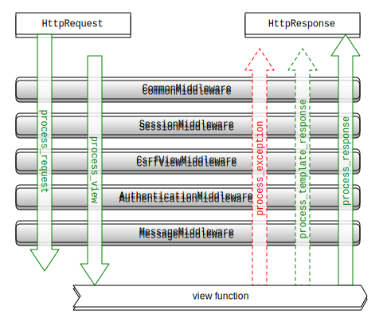

## Request-Response Cycle

The request-response cycle is probably the most important part needed to understand in a Django project.


WSGI : Python Web Server Gateway Interface  https://www.python.org/dev/peps/pep-0333/


## Middleware Order

> Middleware is a framework of hooks into Django’s request/response processing. It’s a light, low-level “plugin” system for globally altering Django’s input or output.

https://docs.djangoproject.com/en/2.1/topics/http/middleware/




Exercise:

Create a middleware that logs/prints all requests durations.

Reference: https://docs.djangoproject.com/en/2.1/topics/http/middleware/


## Create a basic view
Given one of the previous query we saw in on the other chapter.
Create a function based view that returns a json of that queryset.


````python
def riego_streams(request):
    pass   
    
````


## Creating a basic API

We'll create some endpoints to expose data with 

It's not mandatory to use DRF, we could use it plain old Django.

DRF, with a cost of abstractions, some verbosity (and some performance) gives us:

* Concern separation, more plugable than function based views

  (Validation, Pagination, Renderers, Parsers, Permissions, Rate-Limit, Auth plugins..)


Main concepts:

### Serializers:


````python

# serializers.py
from rest_framework.serializers import ModelSerializer
from nodes import models


class NodeSerializer(ModelSerializer):
    class Meta:
        model = models.Node
        fields = '__all__'

````


### Viewsets

Quite abstract class to handle various actions (list, retrieve, update, delete..)


````python
# views.py
from rest_framework import viewsets
from nodes import models


class NodeView(viewsets.ModelViewSet):
    queryset = models.Node.objects.all()
    serializer_class = NodeSerializer
````

````python

# urls.py

from rest_framework import routers

router = routers.SimpleRouter()
router.register(r'data', views.NodeView)

urlpatterns = [
    # Not default admin because of possible attacks to known urls
    # The admin can be removed if it's not gonna be used
    path('config_admin/', admin.site.urls),
] + router.urls
````

Exercise:

Given the above examples, create endpoints for stream and data.
No need for nested them --> ``Flat is better than nested``


## Django and OpenAPI

Swagger 2.0

OpenAPI 3.0

When working with code and a API spec there are three options.


**1. Create an API spec and Code it separately**
Pros:
   - Simpler, there is no directly relation between API spec and code.
   - Easier to integrate in current projects, as it doesnt make any assumption about how is coded.

Cons:
   - It's easier to make mistakes by the developer due to not having fully syncronized Spec and Code.

**2. API First way**
This is probably the most elegant solution, and other tools in the python ecosystem use this like [Connexion](https://github.com/zalando/connexion#connexion-features).
In this way we would write first the 4th platform spec, and we would have the incoming request validated thought that spec.

Unfortunately, I haven't found a way to integrate something like the above tool in a Django project.

The [bravado-core](https://github.com/Yelp/bravado-core) library seems promising, but I haven't tested deeply.

**3. Code first way**

In this way, we code the API, for example with [DRF](https://www.django-rest-framework.org/) and its serializers and the tooling will create and OpenAPI spec for us based on the code.
This is the approach we have used in [SS-API](https://github.com/Telefonica/smart-steps-api/blob/develop/ssapi/api/views/audiences.py#L28) and we are quite happy with it, but note there is no 4th integration there, so there is not any custom values as *scope* in the spec. 

We serve a /schema.json file in our service in order to integrate it with [luca apidocs](https://github.com/Telefonica/lucaapidocs)

### DRF-YASG

[drf-yasg](https://drf-yasg.readthedocs.io/en/stable/)
Automatic generation of Swagger 2.0 spec based on DRF serializers and views (introspection) and some annotations.


## Business Logic on Django

* Never make business logic in VIEWS. Views are for validating input and returning responses. (Difficult with DRF)
* Django advice for FAT models --> It's ok on little to medium projects.
* Prefer using managers and querysets to chain filters, models for simple properties
* Create another layer called Service to reuse business logic.

References:

https://www.youtube.com/watch?v=Fqhpr_SXqzs

https://www.youtube.com/watch?v=yG3ZdxBb1oo


